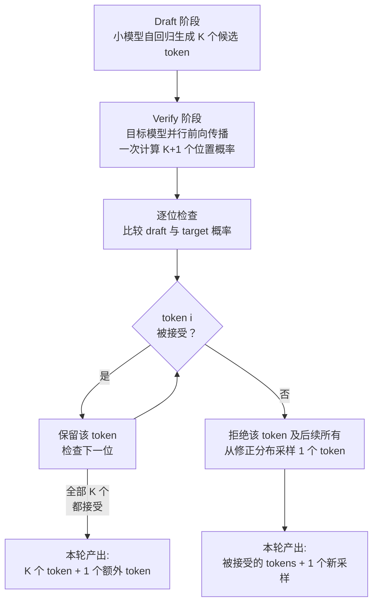
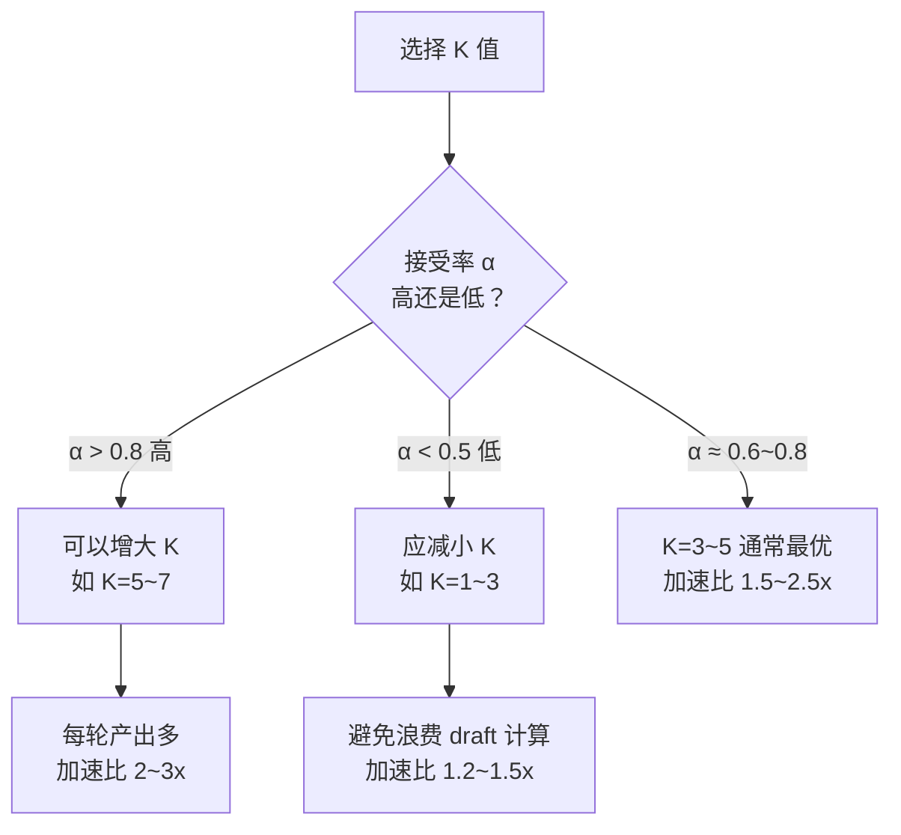

# 第 15 章：Speculative Decoding

> "The best way to make a slow thing fast is to avoid doing it at all." —— Mike Acton。Speculative Decoding 的精妙之处在于，它不是让单步解码更快，而是让一步"验证"替代多步"生成"。

## 15.1 自回归解码的带宽瓶颈

LLM 的推理分为两个阶段：prefill 是计算密集型的，大量 token 并行处理矩阵乘法，GPU 算力得到充分利用；而 decode 阶段每次只生成一个 token，每一步都需要从显存中读取模型全部参数，却只执行极少量的计算。

以一个 70B 参数的模型为例，decode 阶段每一步需要读取约 140GB 的权重数据（float16），而实际的计算量仅为数百 GFLOPS。在 A100 GPU 上，显存带宽约 2TB/s，理论上每秒最多执行约 14 步解码——这就是 memory-bandwidth bound 的含义。GPU 的算力在 decode 阶段只被利用了很小的比例，大量的 CUDA Core 和 Tensor Core 处于空闲状态。

Speculative Decoding（推测解码）正是为了打破这一瓶颈而生：既然 GPU 有富余的算力，何不利用它来"猜测"多个 token，然后一次性验证？

## 15.2 核心原理：猜测-验证框架

Speculative Decoding 的工作流程分为三步：

**第一步：Draft（猜测）。** 使用一个更小、更快的"草稿模型"（draft model）自回归地生成 K 个候选 token。例如，用一个 1B 参数的模型为 70B 的目标模型生成 5 个候选 token。小模型的 decode 速度远快于大模型（参数少意味着需要读取的数据量小）。

**第二步：Verify（验证）。** 将这 K 个候选 token 连同原始上下文一起送入目标模型，执行一次前向传播。由于这 K 个 token 的位置是已知的，目标模型可以像 prefill 一样并行处理它们，在一次前向传播中计算出所有 K+1 个位置的概率分布（K 个候选位置加上下一个新位置）。

**第三步：Accept/Reject（接受/拒绝）。** 将目标模型对每个候选 token 的概率与草稿模型的概率进行比较，通过拒绝采样（rejection sampling）决定接受哪些 token。如果草稿模型的预测与目标模型一致（概率足够高），则接受该 token；否则拒绝，并从修正后的分布中重新采样。

下面的流程图展示了猜测-验证框架的完整时序：



关键的数学保证是：**经过拒绝采样的输出分布与直接从目标模型采样的分布完全一致。** 换言之，speculative decoding 不会改变生成质量，它是一种无损加速技术。

## 15.3 vLLM 中的实现架构

vLLM 的 speculative decoding 实现位于 `vllm/v1/spec_decode/` 目录下（v1 架构）。整个系统由以下几个关键组件构成：

**Eagle Worker**（`vllm/v1/spec_decode/eagle.py`）：实现了 EAGLE 风格的推测解码。EAGLE（Extrapolation Algorithm for Greater Language-model Efficiency）是一种高效的推测方法，它不使用独立的草稿模型，而是在目标模型之上添加一个轻量级的推测头（speculative head），利用目标模型的 hidden states 直接预测后续 token。

在 vLLM 的 v1 架构中，speculative decoding 深度集成在 GPU Model Runner 中。`vllm/v1/worker/gpu_model_runner.py` 中的执行逻辑会根据配置决定是否启用推测解码，协调 draft 和 verify 两个阶段的执行。

## 15.4 拒绝采样的数学细节

拒绝采样是 speculative decoding 的理论基石。对于候选序列中位置 t 的 token x_t，设草稿模型给出的概率为 q(x_t)，目标模型的概率为 p(x_t)，接受概率为：

```
accept_prob = min(1, p(x_t) / q(x_t))
```

如果被拒绝，则从修正分布 `max(0, p(x) - q(x))` 的归一化形式中重新采样。这个过程从左到右逐位检查：一旦某个位置被拒绝，后续所有候选 token 都作废。

因此，如果 K 个候选 token 中前 3 个被接受、第 4 个被拒绝，那么本轮总共产出 4 个有效 token（3 个接受的 + 1 个从修正分布采样的）。与标准 decode 的 1 个 token 相比，实现了 4 倍的加速。

平均接受率取决于草稿模型与目标模型的一致性。在实践中，使用同系列的小模型作为 draft（如用 LLaMA-1B 为 LLaMA-70B 做草稿），典型的接受率在 70%~90% 之间。

## 15.5 Draft 模型的多种选择

vLLM 支持多种草稿生成策略，适应不同的部署场景：

**独立小模型**：使用同家族的小模型，例如用 Qwen2-0.5B 为 Qwen2-72B 做草稿。优点是通用性强、不需要额外训练；缺点是需要额外的显存加载草稿模型。

**EAGLE 推测头**：在目标模型之上训练一个轻量级的头部网络，直接利用目标模型的 hidden states 预测后续 token。由于共享了大部分计算和 KV Cache，EAGLE 的额外开销极小，是目前效率最高的方案之一。vLLM 在 `vllm/v1/spec_decode/eagle.py` 中实现了这一方案。

**Medusa 并行预测头**：与 EAGLE 类似使用额外的预测头，但 Medusa 为每个未来位置训练独立的头部网络，并通过树状注意力（tree attention）组合候选序列。这允许更高的推测并行度。

**N-gram 草稿**：最简单的方案——基于已生成文本中的 n-gram 模式预测后续 token，完全不需要额外模型。在重复性强的文本（如代码生成、结构化输出）中表现出人意料地好。

## 15.6 配置与调优

用户通过 `SpeculativeConfig` 控制 speculative decoding 的行为，关键参数包括：

**`num_speculative_tokens`（K）**：草稿模型每次生成的候选 token 数。K 越大，理论加速比上限越高（最多 K+1 倍），但接受率会随 K 的增大而降低。实践中 K=3~5 通常是最优区间。

**`draft_model`**：指定草稿模型的路径或名称。对于 EAGLE 方案，指定 EAGLE 权重的路径。

**`speculative_disable_mqa_scorer`** 等高级参数可以控制验证阶段的具体实现。

调优的核心原则是找到 **K 与接受率的最佳平衡点**。理论加速比的计算公式近似为：

```
speedup ≈ (1 - α^(K+1)) / ((1 - α) * (c * K + 1))
```

其中 α 是平均接受率，c 是草稿模型相对于目标模型的时间比。当 α 高且 c 小时，加速效果最显著。

下图展示了接受率与 K 值对加速比的影响决策：



## 15.7 与调度系统的集成

Speculative decoding 需要与 vLLM 的调度系统紧密协作。在启用推测解码时，每轮迭代的 token 产出从确定的 1 个变为不确定的 1~K+1 个。这影响了 KV Cache 的分配策略——调度器需要为每个序列预留可能用到的额外块。

在 v1 架构中，`vllm/v1/core/sched/scheduler.py` 中的调度逻辑会感知 speculative decoding 的存在，在分配 KV Cache 块时考虑推测生成的最大 token 数。被拒绝的候选 token 对应的 KV Cache 需要被及时回收，避免内存泄漏。

## 15.8 性能表现

Speculative decoding 在实际部署中的加速效果取决于多个因素：

- **模型大小**：目标模型越大，decode 阶段的带宽瓶颈越严重，加速效果越明显
- **接受率**：与任务类型相关——代码补全、翻译等确定性较高的任务接受率高，开放式创意写作接受率低
- **硬件配置**：在计算与带宽比值高的硬件上（如 H100）效果更好

典型的加速范围为 **1.5~2.5 倍**。对于代码生成等高接受率场景，使用 EAGLE 方案可以接近 3 倍加速。需要强调的是，这种加速是**无损的**——生成分布与目标模型完全一致。

## 本章常见问题

**Q：Speculative Decoding 会改变模型的输出质量吗？**

不会。拒绝采样保证了最终的 token 分布与直接从目标模型采样完全一致。这是一种数学上严格的无损加速技术。唯一的"代价"是在接受率低时加速效果不明显，但绝不会降低质量。

---

**Q：EAGLE 和独立小模型方案哪个更好？**

EAGLE 通常效率更高，因为它复用了目标模型的 hidden states，额外参数和计算量极小。但 EAGLE 需要针对目标模型专门训练推测头，而独立小模型方案（如用 LLaMA-1B 为 LLaMA-70B 做草稿）无需额外训练，通用性更强。选择取决于是否愿意投入训练成本。

---

**Q：为什么 K 不能设得很大（如 K=20）来获得更高加速？**

因为接受率随 K 增大而递减——后面的 token 越来越难"猜对"。当第 i 个 token 被拒绝时，第 i+1 到第 K 个候选全部作废。K 过大意味着大量 draft 计算被浪费，反而可能比 K 较小时更慢。最优 K 值取决于任务特性和 draft 模型质量。

---

**Q：Speculative Decoding 对 KV Cache 管理有什么影响？**

调度器需要为每个序列预留最多 K 个额外 token 的 KV Cache 块。被拒绝的候选 token 对应的 KV Cache 必须及时回收，否则会造成内存泄漏。vLLM 的调度器在分配块时会考虑推测解码的最大 token 数，确保资源充足。

---

## 本章小结

Speculative Decoding 通过"猜测-验证"框架打破了自回归解码的带宽瓶颈。小型草稿模型快速生成候选 token，目标模型通过一次并行前向传播验证多个位置，拒绝采样保证输出分布的精确一致性。vLLM 支持独立小模型、EAGLE 推测头、Medusa 并行头和 N-gram 草稿等多种策略，通过 `vllm/v1/spec_decode/` 中的实现与调度器、KV Cache 管理器深度协作。在 `num_speculative_tokens` 和接受率的最优平衡点上，speculative decoding 能实现 1.5~2.5 倍的无损加速，是 vLLM 面向生产部署的重要性能优化手段。
